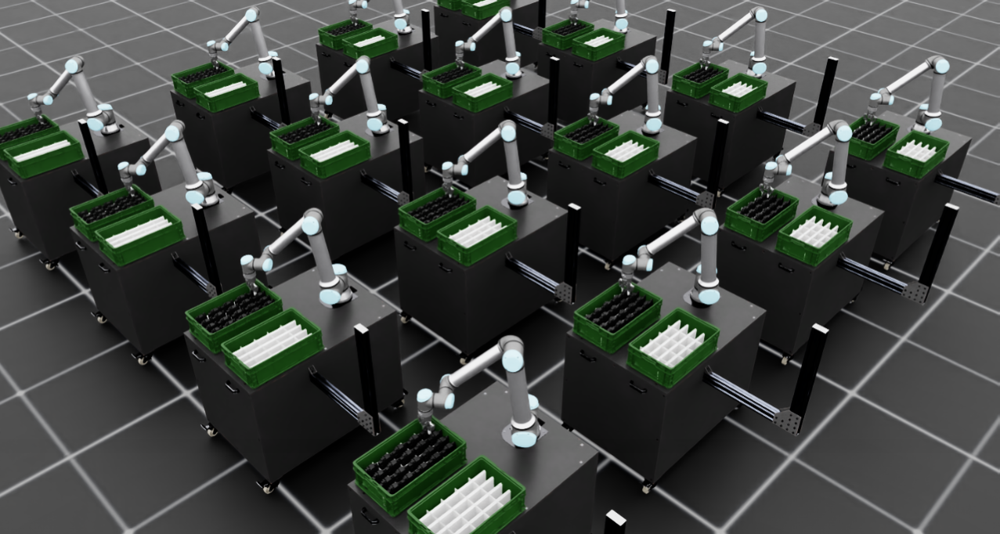

# GM-SafePick: Proactive Physical Safety Reasoning for Robot Manipulation


## 1. Overview

**GM-SafePick** is a pick-and-place demo platform built on **Isaac Lab** for validating robotic manipulation workflows and **proactive physical safety reasoning** in simulation. It implements a three-layer safety framework (rule-based → data-driven → VLM-enhanced) for human-robot co-working scenarios, aligned with the paper *Proactive Physical Safety Reasoning for Robot Manipulation*.

| Risk Type | Description | Example |
|:----------|:------------|:--------|
| Static | Spatial conflict without motion | Human hand stationary within robot reach radius |
| Dynamic | Risk from motion and timing | Hand rapidly entering end-effector trajectory |
| Functional | Improper tool use or mechanical interaction | Operating rotating drill without gloves |

The platform features a **UR10e** robot arm with gripper, operating in a table-mounted workcell with two containers (source/destination, each with a 5×4 slot grid). A three-layer safety system evaluates every motion step at 20 Hz:

- **Layer 1 (Rule-based)**: Real-time distance + TTC gating, `< 1 ms` latency, always online.
- **Layer 2 (Data-driven)**: ML classifier ensemble fusion, `< 50 ms` latency.
- **Layer 3 (VLM-enhanced)**: Vision-language model reasoning (Qwen2.5-VL-7B) with Grounding DINO + SAM2 perception, ~1 Hz, non-blocking.

> **Current phase**: Phase 1 ✅ (Layer 1 complete), Phase 2 (Layer 2 offline pipeline ready), Phase 3.5/4 (Motion Replan in progress). See [docs/](source/GMRobot/docs/) for full architecture and roadmap.

---

## 2. System Requirements

| Component | Requirement |
|:----------|:------------|
| **GPU** | NVIDIA GPU with driver ≥ 535 (tested: RTX 4090, L40S) |
| **OS** | Ubuntu 22.04, GLIBC ≥ 2.35 |
| **Python** | 3.10 or 3.11 |
| **Disk** | ≥ 50 GB free (Isaac Sim + assets + model caches) |
| **Network** | Internet access for first-run Omniverse asset downloads (Nucleus) |
| **RAM** | ≥ 32 GB recommended |

### For Layer 3 (VLM + Perception, optional)

A separate **AI server** with NVIDIA GPU (≥ 48 GB VRAM, e.g. L40S) is recommended for hosting the VLM and perception services. This server communicates with the Isaac Sim node via SSH tunnel. See [§6](#6-ai-server-setup-layer-3-vlm--perception-optional) for setup.

---

## 3. Installation

### 3.1 Install Isaac Lab

Isaac Lab is the **required** simulation foundation. Follow the [official pip installation guide](https://isaac-sim.github.io/IsaacLab/main/source/setup/installation/pip_installation.html).

**Recommended approach — conda installation:**

```bash
# 1. Create conda environment
conda create -y -n env_isaaclab python=3.10 pip
conda activate env_isaaclab

# 2. Install PyTorch (CUDA 12.4)
pip install torch torchvision --index-url https://download.pytorch.org/whl/cu124

# 3. Install Isaac Sim pip packages
pip install isaacsim-rl isaacsim-replicator isaacsim-extscache-physics isaacsim-extscache-kit-sdk isaacsim-extscache-kit isaacsim-app --extra-index-url https://pypi.nvidia.com

# 4. Install Isaac Lab
git clone https://github.com/isaac-sim/IsaacLab.git /path/to/IsaacLab
cd /path/to/IsaacLab
pip install -e .
```

> **Note**: An active NVIDIA Omniverse account and license are required. See [Isaac Sim requirements](https://docs.omniverse.nvidia.com/isaacsim/latest/installation/requirements.html).

**Alternative — uv installation (faster):**
```bash
# Follow the uv-based pip installation in the official Isaac Lab docs
# This avoids conda and uses uv for dependency resolution
```

### 3.2 Clone GM-SafePick

Clone the project repository **separately** from the Isaac Lab installation:

```bash
git clone https://github.com/OVERLORD799/gmrobot.git /path/to/GMRobot
cd /path/to/GMRobot
```

> For private repository access via GitHub token, see [§8](#8-remote-headless-running).

### 3.3 Editable Install

Using the same Python interpreter that has Isaac Lab installed:

```bash
# Activate Isaac Lab environment first
conda activate env_isaaclab

# Install GM-SafePick in editable mode
pip install -e source/GMRobot
```

**With optional dependencies:**

```bash
# For Layer 2 ML classifier training (scikit-learn)
pip install -e "source/GMRobot[safety_train]"

# For Layer 2 with XGBoost support
pip install -e "source/GMRobot[safety_train_xgb]"
```

### 3.4 Verify Installation

```bash
python scripts/list_envs.py
```

Expected output should list registered tasks including `Template-Gmrobot-v0`. If the task name changes, update the search pattern in `scripts/list_envs.py`.

```bash
# Quick smoke test — import check
python -c "import isaacsim; from GMRobot.tasks import *; print('GM-SafePick: OK')"
```

### 3.5 Environment Activation Script (Convenience)

Create a one-line activation script for repeated use:

```bash
# Example: /path/to/activate_isaaclab.sh
#!/bin/bash
source /opt/conda/etc/profile.d/conda.sh       # adjust to your conda path
conda activate env_isaaclab
export TERM=xterm
cd /path/to/GMRobot
```

Then use `source /path/to/activate_isaaclab.sh` before any run.

---

## 4. Quick Start

### 4.1 Basic Demo (with GUI)

```bash
source /path/to/activate_isaaclab.sh
python scripts/gm_state_machine_agent.py --task=gm
```

This launches the Isaac Sim window and runs the full 20-part pick-and-place sequence.

### 4.2 Headless (No GUI, remote/server)

```bash
source /path/to/activate_isaaclab.sh
python scripts/gm_state_machine_agent.py --task=gm --headless
```

### 4.3 With Safety Layer Enabled

```bash
python scripts/gm_state_machine_agent.py --task=gm --enable_safety
```

### 4.4 With Cameras (required for Layer 3 VLM)

```bash
python scripts/gm_state_machine_agent.py --task=gm --headless --enable_cameras
```

### 4.5 Parallel Environments (16× throughput)

```bash
python scripts/gm_state_machine_agent.py --task=gm --num_envs=16
```



### 4.6 Short Test Run (1 Part Only)

Edit `DEFAULT_USER_COMMANDS` in [scripts/gm_state_machine_agent.py](scripts/gm_state_machine_agent.py) to:

```python
DEFAULT_USER_COMMANDS = [
    {"pick": "A@1", "place": "B@1"},
]
```

---

## 5. Configuration System

GM-SafePick uses YAML-driven configuration files in [`configs/`](configs/). Key configs:

| Config File | Purpose |
|:------------|:--------|
| [`configs/safety_layer1.yaml`](configs/safety_layer1.yaml) | Layer 1 thresholds: `safe_dist_hard_stop`, `safe_dist_warn`, TTC params, workspace bounds |
| [`configs/safety_layer1_stress.yaml`](configs/safety_layer1_stress.yaml) | Stress-test preset (aggressive human motion) |
| [`configs/safety_layer1_ttc.yaml`](configs/safety_layer1_ttc.yaml) | TTC-focused preset (closing-speed scenarios) |
| [`configs/safety_fusion.yaml`](configs/safety_fusion.yaml) | Layer 1+2 fusion: `fusion_mode`, ensemble weights |
| [`configs/safety_layer2_train.yaml`](configs/safety_layer2_train.yaml) | Layer 2 training: model type, hyperparameters |
| [`configs/vlm_client.yaml`](configs/vlm_client.yaml) | VLM service endpoint (default: `http://127.0.0.1:18080`) |
| [`configs/perception_client.yaml`](configs/perception_client.yaml) | Perception service endpoint (default: `http://127.0.0.1:18082`) |
| [`configs/ivj/`](configs/ivj/) | Human trajectory scene registry (6 preset scenarios + `registry.yaml`) |

**Using a custom config:**
```bash
python scripts/gm_state_machine_agent.py --task=gm --enable_safety --safety_config configs/safety_layer1_stress.yaml
```

---

## 6. AI Server Setup (Layer 3: VLM + Perception, Optional)

Layer 3 requires a separate AI server running VLM inference and perception services. The Isaac Sim node communicates with it via SSH tunnel.

### 6.1 AI Server Requirements

| Component | Specification |
|:----------|:--------------|
| GPU | NVIDIA L40S 48 GB (or equivalent) |
| Driver | ≥ 570 |
| OS | Ubuntu 22.04 |
| Python | 3.11 (conda) |

### 6.2 VLM Service Installation (on AI server)

```bash
# 1. SSH into AI server
ssh <ai-server>

# 2. Create conda environment
source /opt/conda/etc/profile.d/conda.sh
conda create -y -p /path/to/conda-envs/vlm python=3.11 pip
conda activate /path/to/conda-envs/vlm

# 3. Install PyTorch with CUDA 12.4
pip install torch torchvision --index-url https://download.pytorch.org/whl/cu124

# 4. Install VLM dependencies
pip install transformers accelerate qwen-vl-utils pillow bitsandbytes \
    fastapi uvicorn[standard] httpx

# 5. Set HuggingFace mirror (if direct access is blocked)
export HF_HOME=/path/to/huggingface
export HF_ENDPOINT=https://hf-mirror.com
```

### 6.3 Perception Service Installation (on AI server)

```bash
# Same conda environment as VLM
conda activate /path/to/conda-envs/vlm

pip install opencv-python-headless supervision sam2

# Download SAM2.1 checkpoint
python - <<'PY'
from huggingface_hub import hf_hub_download
hf_hub_download(
    repo_id="facebook/sam2.1-hiera-tiny",
    filename="sam2.1_hiera_tiny.pt",
    local_dir="/path/to/perception-service/checkpoints",
)
PY
```

### 6.4 Start Services (on AI server)

```bash
# Start VLM service (port 8080)
nohup /path/to/vlm-service/start.sh >> /path/to/vlm-service/server.log 2>&1 &

# Start perception service (port 8082)
nohup /path/to/perception-service/start.sh >> /path/to/perception-service/server.log 2>&1 &

# Verify both are healthy
curl -s http://127.0.0.1:8080/health   # → {"status":"ok","model_id":"Qwen/Qwen2.5-VL-7B-Instruct",...}
curl -s http://127.0.0.1:8082/health   # → {"status":"ok",...}
```

> Services can be managed via `supervisord` for automatic restart. See [AI Server Deployment Guide](source/GMRobot/docs/GM-SafePick_AI服务器部署.md#4-服务启动与常驻) for details.

### 6.5 SSH Tunnel (from Isaac Sim node to AI server)

On the Isaac Sim machine, establish tunnels forwarding remote ports to local:

```bash
# Forward VLM (8080 → 18080) and Perception (8082 → 18082)
ssh -f -N \
  -L 18080:127.0.0.1:8080 \
  -L 18082:127.0.0.1:8082 \
  -p <SSH_PORT> root@<AI_SERVER_HOST>

# Verify tunnels
curl -s http://127.0.0.1:18080/health
curl -s http://127.0.0.1:18082/health
```

### 6.6 Full-Stack Test (Isaac Sim + VLM + Perception)

```bash
python scripts/gm_state_machine_agent.py \
  --task=gm --headless --enable_cameras --enable_safety \
  --max_steps=500 --progress_interval=100 \
  --enable_vlm --enable_perception
```

After completion, verify `output/safety_logs/<run_id>/episode_0000.csv`: VLM columns (`vlm_risk_class`, `vlm_confidence`, `vlm_suggested_action`, `vlm_model_id`) should be non-empty at VLM inference steps.

---

## 7. System Architecture

### Three-Layer Safety Stack

```
20 Hz Real-time Decision Loop (always online)
┌──────────────────────────────────────┐
│ Layer 1: Rule-based Safety           │  ← Always enabled
│   Input: robot + human pose state    │
│   Output: g_t ∈ {ALLOW, STOP, SLOW}  │
│   Latency: < 1 ms                    │
└──────────────────┬───────────────────┘
                   ↓
┌──────────────────────────────────────┐
│ Layer 2: Data-driven Safety          │  ← Enabled after Layer 1 data ready
│   Input: obs + action + L1 outcome   │
│   Output: g_t (ensemble fusion)      │
│   Latency: < 50 ms                   │
└──────────────────┬───────────────────┘
                   ↓
┌──────────────────────────────────────┐
│ Layer 3: VLM Reasoning Enhancement   │  ← Enabled after L1+L2 stable
│   Input: RGB image + text prompt     │
│   Output: non-blocking risk prediction│
│   Frequency: ~1 Hz                   │
└──────────────────────────────────────┘

Final safety gate: g_t = g_rule ∨ g_ml  →  STOP on any alarm
VLM provides auxiliary decisions + operator alerts (non-blocking)
```

### Layers are complementary, not alternatives

- **Layers 1/2** provide real-time veto (< 50 ms), always online.
- **Layer 3** provides semantic understanding and explanations (~1 Hz), does not block the control loop.
- **Motion Replan** (Phase 3.5/4) provides trajectory-level avoidance, decoupled from VLM inference.

### Layer Capability Coverage

| Capability | Layer 1 | Layer 2 | Layer 3 |
|:-----------|:-------:|:-------:|:--------:|
| Static spatial conflict | ✅ Precise | ✅ Learnable | ✅ (slow) |
| Dynamic TTC evaluation | ⚠️ Manual tuning | ✅ Auto-learned | ✅ Good |
| Functional risk | ❌ | ⚠️ Needs labeling | ✅ Zero-shot |
| Open-set detection | ❌ | ❌ | ✅ GDINO+SAM2 |
| Explanation generation | ❌ | ❌ | ✅ Natural language |
| Always online | ✅ 20 Hz | ✅ 20 Hz | ❌ ~1 Hz |

---

## 8. Remote / Headless Running

### Background Execution (survives SSH disconnect)

```bash
source /path/to/activate_isaaclab.sh

nohup python scripts/gm_state_machine_agent.py \
  --task=gm --headless --enable_cameras \
  > /path/to/demo.log 2>&1 &

echo $! > /path/to/demo.pid
```

Monitor progress:
```bash
tail -f /path/to/demo.log
```

Stop the task:
```bash
kill $(cat /path/to/demo.pid)
```

### VNC Remote Viewing (3D visualization)

```bash
# Install (Ubuntu)
apt-get install -y tigervnc-standalone-server tigervnc-common dbus-x11

# Set password
vncpasswd

# Start virtual desktop on :1
vncserver :1 -geometry 1920x1080 -depth 24

# Inside VNC desktop terminal, run without --headless:
source /path/to/activate_isaaclab.sh
python scripts/gm_state_machine_agent.py --task=gm

# When done
vncserver -kill :1
```

Connect from local machine: `vnc://<server_ip>:5901`

### First-Run Notes

- **First run** downloads Omniverse Nucleus assets (e.g. `SeattleLabTable`), which may take 10–30 minutes.
- Project-specific assets (robot, containers, dividers, parts) are loaded from **local USD files** in `source/GMRobot/GMRobot/assets/`.
- These assets are excluded from Git (`.gitignore`); ensure they are present locally.

---

## 9. Control Interfaces

### State-Machine Stages

The controller executes 10 motion stages per pick-and-place command:

1. Move to home/start pose
2. Move above the pick slot
3. Descend to grasp height
4. Close gripper
5. Hold/grasp
6. Lift the part
7. Move above the target slot
8. Descend to place height
9. Open gripper to release
10. Lift away

### Action Interface (8-dimensional)

| Index | Field | Description |
|:------|:------|:------------|
| 1 | End-effector x | Cartesian position |
| 2 | End-effector y | Cartesian position |
| 3 | End-effector z | Cartesian position |
| 4 | Quaternion w | Orientation |
| 5 | Quaternion x | Orientation |
| 6 | Quaternion y | Orientation |
| 7 | Quaternion z | Orientation |
| 8 | Gripper command | Binary joint-position controller |

### Customizing Commands

Modify `DEFAULT_USER_COMMANDS` in [scripts/gm_state_machine_agent.py](scripts/gm_state_machine_agent.py):

```python
# Format: {"pick": "<container>@<slot_id>", "place": "<container>@<slot_id>"}
# Slots: 1–20, Containers: A (source) or B (destination)
DEFAULT_USER_COMMANDS = [
    {"pick": "A@1", "place": "B@4"},
    {"pick": "A@2", "place": "B@3"},
    {"pick": "A@5", "place": "B@10"},
]
```

---

## 10. CLI Reference

```bash
# Core flags
--task=gm              # Task name (required)
--headless             # Run without GUI window
--num_envs=N           # Parallel environments (default: 1)
--max_steps=N          # Max simulation steps before auto-exit
--progress_interval=N  # Print progress every N steps
--enable_cameras       # Enable scene RGB camera (required for VLM)
--enable_safety        # Enable Layer 1 safety gating
--safety_config PATH   # Custom safety config YAML
--enable_vlm           # Enable Layer 3 VLM inference (needs AI server + tunnel)
--enable_perception    # Enable GDINO+SAM2 object detection
--enable_perception_track  # Enable SAM2 temporal tracking
```

### Example: Full safety stack

```bash
python scripts/gm_state_machine_agent.py \
  --task=gm --headless \
  --enable_cameras --enable_safety \
  --enable_vlm --enable_perception --enable_perception_track
```

---

## 11. Running Tests

```bash
# Unit tests (safety rule engine)
python scripts/test_rule_engine_unit.py

# Unit tests (replan)
python scripts/test_replan_unit.py

# Unit tests (envelope computation)
python scripts/test_envelope_unit.py

# Unit tests (safety logger - VLM)
python scripts/test_safety_logger_vlm_unit.py

# Unit tests (safety logger - perception)
python scripts/test_safety_logger_perception_unit.py

# Unit tests (safety logger - replan)
python scripts/test_safety_logger_replan_unit.py

# Perception client smoke test
python scripts/test_perception_client.py

# Safety regression suite
bash scripts/run_safety_regression.sh

# Human motion test
python scripts/test_human_motion.py
```

---

## 12. Project Structure

```
GMRobot/
├── README.md                          # This file
├── setup.py                           # Package install script
├── pyproject.toml                     # Build system config
├── scripts/                           # Entry-point scripts
│   ├── gm_state_machine_agent.py      # Main demo runner
│   ├── pick_and_place_policy.py       # State-machine policy
│   ├── list_envs.py                   # Environment registration check
│   ├── report_safety_metrics.py       # Offline safety metrics
│   ├── report_ivj_summary.py          # IV-J scene summary
│   ├── run_layer2_ab.py              # Layer 2 A/B testing
│   ├── train_safety_layer2.py         # Layer 2 classifier training
│   └── test_*.py                      # Unit + integration tests
├── configs/                           # YAML configuration files
│   ├── safety_layer1.yaml             # Layer 1 thresholds
│   ├── safety_fusion.yaml             # L1+L2 fusion config
│   ├── vlm_client.yaml                # VLM endpoint config
│   ├── perception_client.yaml         # Perception endpoint config
│   └── ivj/                           # Human trajectory presets
├── source/GMRobot/                    # Python package
│   ├── GMRobot/
│   │   ├── safety/                    # Safety layers (L1 rule engine, L2 ML, GT)
│   │   ├── perception/                # Perception client (GDINO + SAM2)
│   │   ├── vlm/                       # VLM client
│   │   ├── tasks/                     # Isaac Lab task definitions
│   │   └── assets/                    # Local USD assets (not in git)
│   └── docs/                          # Full architecture & development docs
│       ├── GM-SafePick_架构总览.md     # Architecture overview (SSOT)
│       ├── GM-SafePick_Layer1_规则安全层.md
│       ├── GM-SafePick_Layer2_数据驱动安全层.md
│       ├── GM-SafePick_Layer3_VLM推理增强层.md
│       ├── GM-SafePick_AI服务器部署.md  # AI server deployment guide
│       ├── GM-SafePick_远程运行指南.md  # Remote running guide
│       └── adr/                       # Architecture Decision Records
└── tests/                             # Pytest-based tests
```

---

## 13. Troubleshooting

### `No module named 'isaacsim'`

```bash
source /path/to/activate_isaaclab.sh
python -c "import isaacsim; print('ok')"
```
If this fails, reinstall Isaac Sim pip packages (see [§3.1](#31-install-isaac-lab)).

### GPU not detected

```bash
nvidia-smi
```
Ensure NVIDIA driver is installed and GPU is visible inside the container/VM.

### USD file not found (`FileNotFoundError`)

Local assets in `source/GMRobot/GMRobot/assets/` must be present. These are excluded from Git (`.gitignore`) — restore them from backup or regenerate.

### First run takes 10–30 minutes

The first run downloads Nucleus assets (`SeattleLabTable`) from Omniverse. This is normal; subsequent runs use the cache.

### `carb.tasking Mutex` crash (headless, long runs)

Isaac Sim 5.1 headless may crash on long runs. Mitigations:
- Shorten `DEFAULT_USER_COMMANDS` to fewer parts
- Use VNC mode (not `--headless`)
- Reduce `--num_envs`

### VLM health check returns `warming` or fails

On the AI server:
```bash
# Check if service is running
pgrep -af "python app.py"

# Check logs
tail -f /path/to/vlm-service/server.log

# Restart if needed
/data/supervisord ctl -c /opt/supervisord.yaml start vlm-service
```

Model loading takes 15–90 seconds after startup before `/health` returns `ok`.

### SSH tunnel drops

Re-establish the tunnel on the Isaac Sim node:
```bash
ssh -f -N -L 18080:127.0.0.1:8080 -L 18082:127.0.0.1:8082 -p <PORT> root@<AI_SERVER>
```

### Private repository: git pull fails

Use a GitHub personal access token:
```bash
git pull "https://x-access-token:<GITHUB_TOKEN>@github.com/OVERLORD799/gmrobot.git" main
```

---

## 14. Documentation Index

| Document | Description |
|:---------|:------------|
| [Architecture Overview](source/GMRobot/docs/GM-SafePick_架构总览.md) | Three-layer architecture, data flow, roadmap |
| [Layer 1: Rule-based Safety](source/GMRobot/docs/GM-SafePick_Layer1_规则安全层.md) | Distance + TTC gating, configuration |
| [Layer 2: Data-driven Safety](source/GMRobot/docs/GM-SafePick_Layer2_数据驱动安全层.md) | ML classifier training, ensemble fusion |
| [Layer 3: VLM Enhancement](source/GMRobot/docs/GM-SafePick_Layer3_VLM推理增强层.md) | VLM + GDINO + SAM2 pipeline |
| [AI Server Deployment](source/GMRobot/docs/GM-SafePick_AI服务器部署.md) | Full AI server setup (VLM + perception + supervisord) |
| [Remote Running Guide](source/GMRobot/docs/GM-SafePick_远程运行指南.md) | Headless, VNC, background execution |
| [Project Progress & Issues](source/GMRobot/docs/GM-SafePick_项目进展与遗留问题.md) | Cross-layer progress dashboard (SSOT) |
| [ADR Directory](source/GMRobot/docs/adr/) | Locked architecture decision records |
| [Paper Translation & Terminology](source/GMRobot/docs/Proactive%20Physical%20Safety%20Reasoning%20for%20Robot%20Manipulation%20中文翻译与术语解析.md) | Chinese translation of reference paper |

---

## 15. Future Direction

- **Phase 4a**: Motion Replan v0 — geometric trajectory avoidance (lift + lateral offset) triggered by Layer 1 warnings.
- **Phase 4b**: VLM-driven replan — VLM Stage 5 `replan` suggestions executed by the Motion Replan module.
- **Extended scenarios**: Multi-human, dynamic obstacles, functional risk assessment.
- **Real-robot transfer**: Adapt safety layers from simulation privileged observations to real sensor inputs.
