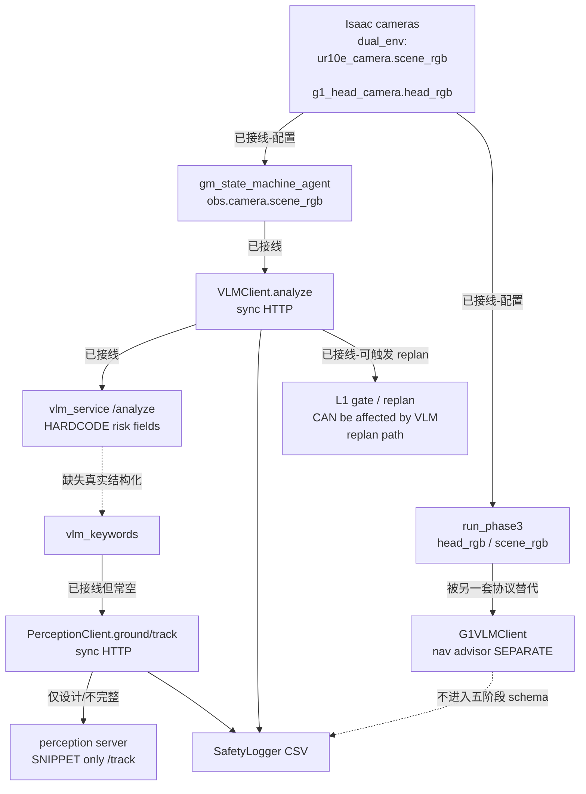

# GMRobot 五阶段 VLM / GDINO / SAM2 只读可行性审计（2026-07-21）

## 0. 结论摘要

| 项 | 结论 |
|---|---|
| 物理基准 B0–B4 | **已冻结**（`defe95e…`）；本轮未改动 |
| 五阶段论文闭环 | **未形成**；不得宣称完成 |
| `shadow_experiment_ready` | **false** |
| Canonical stack | **GMRobot** `VLMClient` + `PerceptionClient` + `SafetyLogger` + `gm_state_machine_agent.py` 接线 |
| 非 canonical | `g1_ur10e_disturbance/g1_vlm_client.py` = **导航/测试顾问**，协议不同，勿混称 |

本轮仅静态审查 + localhost health + 离线单测；**未**建 SSH tunnel、**未** POST 推理、**未**启动服务、**未**读出密钥值。

---

## 1. 冻结边界遵守情况

- 未修改 B0/B1/B2/B4 YAML/代码/结果/镜像。
- 未重建 Docker、未启动 Isaac、未安装/下载模型。
- 未调用 `_ensure_tunnel()`、未创建 SSH tunnel、未 POST `/analyze|/ground|/track`。
- 环境变量与 `.github_token` 仅报告 PRESENT/ABSENT；用户声明“末两行含 VLM 主机/密码”记为 **DECLARED_BY_USER_NOT_VERIFIED**（本轮禁止核验明文）。

---

## 2. Endpoint / 环境检查（localhost only）

| 检查 | 结果 |
|---|---|
| `ss` 监听 `18080/18082/8080` | **无匹配** |
| `GET http://127.0.0.1:18080/health` | **UNAVAILABLE** — not listening; inference not tested |
| `GET http://127.0.0.1:18082/health` | **UNAVAILABLE** — not listening; inference not tested |
| `VLM_HOST/PORT/SSH_*` env | 全部 **ABSENT** |
| `.github_token` | **PRESENT**（约 90 行；内容未导出） |
| `g1_ur10e_disturbance/config/default.yaml` `vlm.ssh.host/port/user` | **PRESENT**；`password/key` **ABSENT_OR_EMPTY** |
| `vlm.port`（default.yaml） | `8080`（与 GMRobot yaml 的 `18080` 转发约定不同） |

配置默认（源码复核）：

- `GMRobot/configs/vlm_client.yaml` → `http://127.0.0.1:18080` `/analyze` `/health`
- `GMRobot/source/GMRobot/GMRobot/vlm/client.py:20` dataclass 默认 `base_url="http://120.209.70.195:8080"`（**与 yaml 不一致**；运行以 yaml 加载为准）
- `GMRobot/configs/perception_client.yaml` → `http://127.0.0.1:18082` `/ground` `/track` `/health`

---

## 3. Canonical stack 建议

**推荐作为五阶段论文实验 canonical stack：**

1. `GMRobot/.../vlm/client.py` — `VLMClient.analyze()`
2. `GMRobot/deploy/ai_server/vlm_service.py` — `/analyze`（需重写结构化输出，见 P0）
3. `GMRobot/.../perception/client.py` — `PerceptionClient.ground/track_*`
4. 完整 perception server（仓库内**仅有** `/track` snippet，缺可部署 `/ground` 服务）
5. `GMRobot/scripts/gm_state_machine_agent.py` — 可选 shadow 接线 + logger
6. `GMRobot/.../safety/logger.py` — CSV 列映射

**明确排除混称：**

| 组件 | 角色 | 协议 |
|---|---|---|
| `G1VLMClient` | G1 导航/对抗测试顾问 | `action/strategy/monitor/coordinate` JSON |
| `VLMClient` | 安全场景结构化分析 | `vlm_risk_*` / keywords（目标） |

保留 `G1VLMClient` 供 GMDisturb 扰动/导航实验；**不得**当作五阶段 Stage1–5 实现。

---

## 4. 实现状态矩阵

级别定义：PRESENT / IMPLEMENTED / WIRED / TESTED / LIVE-VALIDATED（互不合并）。

| # | 阶段 | 状态 | 证据要点 |
|---:|---|---|---|
| 1 | 相机 RGB 获取 | **WIRED**（配置+代码读取）；非 LIVE | `dual_env_cfg.py:385–621` 定义 `scene_camera`/`g1_head_camera`；`run_phase3.py:1390–1451` 读取 `head_rgb`/`scene_rgb`；paper_demo 结果树 **0** 个 png/jpg → 无真实帧 artifact |
| 2 | VLM scene_summary | **PRESENT**（目标 schema 在计划文档）；服务未产出字段 | 计划 `paper-demo-implementation-plan…:497+`；`vlm_service.py` 无 `scene_summary` |
| 3 | VLM keywords | **PRESENT**（logger 列）；服务未返回 | `logger.py:28,254–274`；`vlm_service.py:107–116` 无 keywords |
| 4 | keywords → GDINO | **WIRED**（agent 路径）；有效载荷常空 | `gm_state_machine_agent.py:2002–2010` 把 `vlm_keywords` 传 `text_prompt`；当前服务不产 keywords → 实际退回 yaml 默认 prompt |
| 5 | GDINO boxes | **IMPLEMENTED**（客户端）；服务端不完整 | `perception/client.py:93–112`；仓库无完整 `/ground` app，仅 track snippet |
| 6 | SAM2 mask | **PRESENT/IMPLEMENTED**（客户端+snippet） | `run_sam2` 配置；snippet `_sam2_track_box` |
| 7 | SAM2 temporal track | **IMPLEMENTED**（客户端+snippet）；非 LIVE | `track_init/step/frame`；snippet `/track`；无 lost/reacquired 状态机字段 |
| 8 | consequence + horizon | **缺失** | logger/client/service 均无 `predicted_consequence` / `prediction_horizon_s` |
| 9 | structured safety suggestion | **PRESENT** 但 **stub/hardcode** | `vlm_service.py:107–116` 真实推理后仍固定 `static/medium/slow_down` |
| 10 | shadow logging | **IMPLEMENTED** + **TESTED**（离线） | `logger.py` VLM/perception 列；unit tests PASS |
| 11 | timeout/failure fallback | **IMPLEMENTED**（部分） | 客户端错误 → `{ok:False,error}`；logger 映射 `error`；**禁止的静默 static 在服务端仍存在** |
| 12 | request/frame/track ID 关联 | **缺失/弱** | meta 可带 `step`；无稳定 `request_id`/`frame_id` 贯穿；track 有 `session_id`/`track_id=0`，logger **不落** track_id/state |

---

## 5. 数据流（当前实际）

边标注摘要：

- **已接线**：相机→agent/phase3；VLMClient↔vlm_service；keywords 传参位；logger 映射。
- **仅设计**：目标五阶段 schema、完整 perception deploy。
- **缺失**：consequence/horizon、prompt/schema/model version 贯通、ID 关联、RGB 论文 artifact。
- **被替代**：GMDisturb 使用 `G1VLMClient` 导航协议，非五阶段栈。

---

## 6. Schema 差距（目标 vs 现状）

目标字段（计划文档）对照：

| 字段 | Client | Server (`vlm_service`) | Logger |
|---|---|---|---|
| scene_summary | 无 | 无 | 无 |
| keywords | 期望 `vlm_keywords` | **无** | 有列 |
| risk_type | 透传 | **硬编码 static** | 有列 |
| risk_confidence | 透传 | **无** | 有列 |
| affected_entities | 无 | 无 | 无 |
| predicted_consequence | 无 | 无 | 无 |
| prediction_horizon_s | 无 | 无 | 无 |
| explanation | `vlm_explanation` | 有（模型尾部文本） | 有 |
| suggested_action | 透传 | **硬编码 slow_down** | 有 |
| spatial_hint | 无 | 无 | 无 |
| prompt/schema/model_version | 部分 model_id | model_id | model_id |
| parse_error 显式 | 客户端 error dict | stub 伪装 ok | `vlm_parse_ok`；硬编码仍可标 parse_ok=1 |

**P0：** 真实模型生成后仍覆盖结构化字段（`vlm_service.py:107–116`），不构成真实风险推理。

---

## 7. 已知疑点复核（file:line）

1. **默认 URL**：yaml=`127.0.0.1:18080/18082`；`vlm/client.py:20` dataclass 默认远程 IP — 以 yaml 为准时本地端口正确。
2. **硬编码风险结论**：`vlm_service.py:74–83`（stub）与 **`107–116`（真实推理后仍硬编码）** — **确认属实 → P0**。
3. **两套协议**：`VLMClient` vs `G1VLMClient` — **确认属实**；canonical 见 §3。
4. **keywords→ground**：agent `2002–2010` 有传参；服务无 keywords → **接线存在、语义链路断裂**。
5. **Perception 仅 snippet**：`deploy/perception_track_server_snippet.py`；`deploy/ai_server/` 仅有 `vlm_service` — **确认**。
6. **同步阻塞**：`vlm/client.py:67–75,88–89` timeout 5s；`perception/client.py:272–288` timeout 30s；`run_vlm_inference` 虽注释 “non-blocking” 但 **同步** `analyze`（`499–532`）— **确认 P0 风险**。
7. **相机**：配置定义 + phase3/agent 读取均有；**无** paper_demo RGB 文件证据；**无** LIVE 推理证据。

额外控制泄漏风险：

- `gm_state_machine_agent.py:1402–1462`：VLM 可触发 `vlm_stage5_replan`（非纯 shadow）。
- Perception help 称 “no gate”，但 `enrich_gate_metadata_from_perception_track` + `use_perception_track_strategy` 可影响 replan 策略（`triggers.py:45–54,87–88`）。

---

## 8. P0 / P1

### P0（阻止进入 shadow 实现）

| ID | 问题 | 证据 | 风险 | 最小修复范围 | 应新增测试 | 需用户资源 |
|---|---|---|---|---|---|---|
| P0-1 | VLM 服务硬编码 risk/severity/action | `vlm_service.py:107–116` | 伪能力污染论文数字 | 解析模型 JSON；失败显式 `parse_error`；禁止静默 static | schema round-trip + failure-mode unit | 可运行 VLM endpoint |
| P0-2 | 无完整 perception `/ground` 可部署服务 | 仅 `perception_track_server_snippet.py` | GDINO/SAM2 无法端到端 | 提供/接入完整 server 或只读确认远程已部署路径 | client contract test vs recorded JSON | perception endpoint + 权重 |
| P0-3 | keywords 链路断裂 | 服务无 keywords；agent 传空串 | Stage2→3 不可审计 | 服务输出 keywords；request 带 `request_id` | keywords→text_prompt 单测 | 同 P0-1 |
| P0-4 | 同步 HTTP 可阻塞控制环 | client timeouts；`run_vlm_inference` 同步 | 抖动/卡死 50Hz | 异步 worker/queue；控制环只读缓存 | 队列积压/超时单测 | — |
| P0-5 | VLM 非纯 shadow（可触发 replan） | `gm_state_machine_agent.py:1402–1462` | 污染冻结几何安全路径 | shadow 模式强制不写 gate/replan/clock | leakage=0 门禁 | — |
| P0-6 | 无 request/frame/track 贯通 ID | logger 无 frame_id/request_id/track_state | 无法审计五阶段 | 强制 ID 字段与关联 | ID 一致性单测 | — |
| P0-7 | 无可用 RGB artifact / LIVE 帧证据 | paper_demo 0 图像文件 | V0 回放无法起步 | 下一轮仅采集少量帧（不长仿真） | artifact manifest | 相机采集许可 |
| P0-8 | localhost 服务不可用 | health UNAVAILABLE | 无法 LIVE 验证 | 用户提供可达 endpoint/tunnel（人工） | health smoke（人工审批后） | endpoint + 凭据 |

### P1

| ID | 问题 | 证据 | 最小修复 |
|---|---|---|---|
| P1-1 | 缺 latency 分布/队列指标 | 仅单点 latency_ms | shadow 指标表 |
| P1-2 | 缺 prompt/schema/model_version | 仅 model_id | 版本字段写入 CSV |
| P1-3 | track lost/reacquired 未建模 | session reset 无状态列 | track_state 枚举 |
| P1-4 | 工具/PPE 配对未设计落地 | 仅计划 | V1 后独立配对矩阵 |
| P1-5 | GMDisturb/GMRobot 相机观测键不一致 | `ur10e_camera` vs `camera` | 适配层或统一键 |
| P1-6 | `vlm/client.py` 默认 URL 与 yaml 漂移 | `:20` vs yaml | 默认改为 localhost 或删除误导默认 |

---

## 9. 下一轮最小 shadow 切片（设计 only，本轮不实现）

### V0 — 离线/回放

- 输入：少量已存 RGB（**当前不存在** → 下一轮只采集 N 帧，不开长仿真）。
- 验证：schema、request_id、keywords→boxes、SAM2 track、失败原因、分阶段 latency。
- **不**接入 gate/action/policy clock。

### V1 — Isaac shadow

- 同帧：L1 几何安全（冻结）∥ VLM/perception shadow worker。
- Shadow **禁止**修改 gate/action/clock/replan；`control-leakage=0` 门禁。
- 低频异步；记录 would-stop/would-replan。

### 工具/PPE（只设计）

最小配对：bare hand / gloved hand / hand+tool；同轨迹、同相机、同背景；VLM 语义，GDINO/SAM2 定位跟踪；物理控制仍走冻结基准。

---

## 10. 离线测试执行记录

| 命令 | 退出码 |
|---|---:|
| `python3 -m py_compile`（vlm/perception/logger/vlm_service/snippet/g1_vlm_client） | 0 |
| `cd GMRobot && python scripts/test_safety_logger_vlm_unit.py` | 0 |
| `cd GMRobot && python scripts/test_safety_logger_perception_unit.py` | 0 |
| `PYTHONPATH=... import GMRobot.safety.logger` | 1（触发 IsaacLab 依赖；非本轮阻塞） |

未运行：`test_perception_client.py` 的 live `/ground`（会连服务；本轮禁止）。

---

## 11. 需要用户提供的资源

1. 可达的 **VLM** HTTP endpoint（或审批后的 SSH 隧道参数；凭据已声明在 `.github_token` 末行，**本轮未读取**）。
2. 可达的 **perception** HTTP endpoint（含 `/ground`+`/track`+`/health`），或确认远端已部署完整服务路径。
3. 模型权重/运行时是否已在远端装好（Qwen-VL、GDINO、SAM2）——本轮未验证。
4. 是否允许下一轮 **仅采集少量 RGB 帧** 作为 V0 素材（仍不改冻结基准）。

---

## 12. 停止点

审计完成。**不进入**代码修复、Docker 构建或 shadow 仿真。等待人工审批后再下发“异步无控制副作用的最小 shadow 切片”实现指令。
