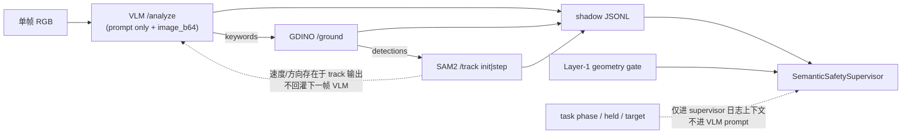

# V1-D2 VLM 语义分类失败：只读根因审计与接口升级设计（2026-07-22）

## 本轮边界

- **不**改代码 / 远端 / 阈值 / 历史结果
- **不**发 POST、不跑 Isaac/Docker、不搜场景、不进 active
- 仅审计与设计；实现留给 D2A/B/C

### 冻结失败证据（不得改写）

| 证据 | Verdict / 结论 | 用途 |
|---|---|---|
| V0-C3 真实负样本 | pipeline PASS；语义为负样本场景（safety disabled） | 基线：单帧 VLM 常出 `static`+低 conf；偶发 `dynamic` 仍 &lt;0.85 |
| V1-C1R-P1 两帧 | 正式 shadow PASS；`accepted=0`（`risk_type_not_allowed`×2） | 负样本合法拒绝；两帧 `static` 0.3/0.2 |
| V1-D1A capture | **FAIL**（geometry + semantic visibility） | 远场红球；几何非全程 ALLOW；**未发 VLM** |
| V1-D1B capture | **GEOMETRY_OVERLAP** | 功能性占用世界坐标成立；live 窗早期非 ALLOW；**未发 VLM** |
| V1-D1B-S 2×VLM | **SEMANTIC_SCREEN_FAIL** | 固定 RGB；两帧 `static` 0.3/0.7；key 不一致 |

**明确禁止**：把单独的 `suggested_action=slow_down` 当作正例（risk_type / confidence / semantic_key 均未过门）。

---

## 1. 当前数据流



**调用顺序（每 shadow 帧）**：`VLM → ground → track`（同帧内串行）。  
**下一帧 VLM**：只看新 RGB + 同一 `STRICT_FIVE_STAGE_PROMPT`；**不**带上一帧 track 摘要、**不**带 detections、**不**带 task goal。

| 输入项 | 是否进入 VLM `/analyze` | 说明 |
|---|---|---|
| 当前 RGB | **是** | `image_b64` |
| safety prompt | **是** | `five_stage_safety_v1` / `STRICT_FIVE_STAGE_PROMPT` |
| task phase / held object / target container | **否** | 控制环有 `transport_phase`/`held_object`；bridge flush 可传入 supervisor，**不进 VLM** |
| protocol 状态 | **否** | 仅 isolation / control hash |
| 上一帧 track velocity/direction | **否** | 同帧 track 在 VLM **之后**；无跨帧回灌 |
| current/previous detections | **否** | ground 在 VLM 之后，不回灌 |
| meta `sim_step`/`episode_id` | 进 HTTP `meta` | **不**改变 prompt 文本；远端不要求用其做分类 |

Legacy 请求体（本地 gateway）：

```text
{ "image_b64", "prompt", "meta": { local_request_id, frame_id, schema_version, prompt_version, remote_contract, … } }
```

解析路径：远端 `text` → `extract_json_object` → 校验 `_TEXT_REQUIRED` → `validate_success_payload`。  
**禁止**用远端 `vlm_*` 顶层字段补造 consequence/entities/hint/`risk_type`/`risk_confidence`/`suggested_action`。

---

## 2. prompt / schema 版本

| 项 | 当前值 |
|---|---|
| prompt_version | `five_stage_safety_v1` |
| schema_version | `five_stage_vlm_v1` |
| contract | `legacy_v2` |
| 模型（历史响应） | `Qwen2.5-VL-7B-Instruct-4bit-nf4` |

### prompt 原文要点（完整模板在 `vlm/legacy_gateway.py`）

- 要求仅输出 JSON；枚举 `risk_type`: `static|dynamic|functional|none`
- **无**各 risk_type 的互斥定义 / 示例
- **无**任务目标、占用、运动证据说明
- `risk_confidence` 仅示意为 `0.0`，无标定指引

### schema / fallback

| 字段 | 来源 | 本地补全？ |
|---|---|---|
| risk_type / risk_confidence / suggested_action | 模型 `text` JSON | **否**（缺失 → schema_error） |
| prompt_version / schema_version / request_id | gateway 注入 | 仅元数据 |
| synthetic | 成功路径默认不设；错误 stub 可标 True | 论文正例禁止 synthetic |
| latency_ms | 远端或 0.0 默认 | 非语义字段 |

---

## 3. 审计问答（当前接口）

| # | 问题 | 答案 |
|---|---|---|
| 1 | VLM 是否只看到单张 RGB？ | **是**（+固定 prompt） |
| 2 | 是否知道任务「把零件放入 B 箱」？ | **否** |
| 3 | 是否知道 B 箱已被异物占用？ | **否**（需从图像自发推断；D1B-S 未推断为 functional） |
| 4 | 是否获得跨帧速度/方向？ | **否**（track 有 `speed_px_s`/`direction_deg`，但在 VLM 之后且不回灌） |
| 5 | risk_confidence 原生还是本地补全？ | **模型原生**（gateway 不填默认 conf） |
| 6 | static/dynamic/functional 是否有互斥定义？ | **无**（仅枚举字符串） |
| 7 | static 是否被理解为「画面物体静止」？ | **高度可能**：解释多为「臂靠近 X 可能碰撞」；与安全机制「静态占用风险」混淆；未见「目标槽位被占用」functional 表述 |
| 8 | 为何 action=slow_down 但 type/conf 不过？ | 模型易给保守动作；type 偏 proximity→`static`；conf 常 0.2–0.7；supervisor 要求 `dynamic|functional` 且 ≥0.85 |
| 9 | semantic_key 为何不一致？ | key 含 **自由文本 entities** + **spatial_hint 逐字**；同场景措辞漂移（device↔container、left↔above/right）即换 key |

---

## 4. 历史逐帧差异表（只读重放，无 POST）

期望分类口径（审计用，非改写结果）：

- V0-C3 / P1 负样本场景：期望 **不** accepted（`static` 拒是合法）
- D1A：期望几何 ALLOW + 可识别动态体；实际几何 FAIL + 红球语义弱 → **无 VLM**
- D1B：期望 functional（目标 B 占用）；capture 几何窗 FAIL；screen 期望 functional/dynamic@≥0.85 且同 key

| scene | explanation 摘要 | keywords | risk_type | conf | action | entities | hint | semantic_key | geometry | track 速度 | task context→VLM? | 期望 | 实际 | 主因类 |
|---|---|---|---|---|---|---|---|---|---|---|---|---|---|---|
| V0-C3 f0 (step0) | 臂靠近 device 可能接触 | arm, device, holes… | static | 0.3 | slow_down | arm, device | left | `static\|…\|device\|robotic arm\|collision\|left` | shadow/safety off | init speed=0 | 否 | 负样本拒 | static 低 conf | prompt 定义 + 单帧 |
| V0-C3 f1 (step50) | 臂似乎在向 container 移动 | arm, container… | **dynamic** | 0.7 | slow_down | arm, container | left | `dynamic\|…\|container\|…\|left` | — | **35.4 px/s @ -45°**（未回灌） | 否 | 若作正例需 ≥0.85+一致 | dynamic 但 conf&lt;0.85；key≠f0 | 上下文缺失 + key 过敏；偶发能力 |
| P1 f0 (step0) | 臂靠近 device | arm, device, compartments… | static | 0.3 | slow_down | arm, device | left | `static\|…\|device\|…\|left` | drain 时 SLOW | init 0 | 否 | 负样本拒 | `risk_type_not_allowed` | 合法；+ 时序 drain |
| P1 f1 (step50) | 臂在 container 正上方 | arm, container… | static | 0.2 | slow_down | arm, container | **above** | `static\|…\|container\|…\|above` | drain SLOW | **25 px/s @ 180°**（未回灌） | 否 | 负样本拒 | 同上；key≠f0 | 同上 |
| D1A s0/s100 | —（无 VLM） | — | — | — | — | — | — | — | 非全程 ALLOW；min_margin&lt;0 | capture 有位移 82px | n/a | dynamic 可见+ALLOW | FAIL | 几何 + 可见性（红球） |
| D1B s100 | —（capture 无 VLM） | — | — | — | — | — | — | — | **ALLOW** TTC=inf | n/a | 世界：blocker∈B | functional | 未评语义 | 几何时序（早期 1–55 非 ALLOW） |
| D1B-S s100 | 臂靠近橙色球体 | arm, orange sphere… | static | 0.3 | slow_down | arm, orange sphere | left | `static\|…\|orange sphere\|…\|left` | ALLOW | 无 track | 否（且无任务提示） | functional | static 低 conf | **上下文缺失** + prompt 定义；球体 distraction |
| D1B-S s200 | 臂靠近球/容器 | arm, container, spherical… | static | 0.7 | slow_down | arm, container, … | **right** | `static\|…\|container\|…\|right` | ALLOW | 无 track | 否 | functional | static；key≠100 | 同上 + **key 过敏** |

### 根因分类汇总

| 类别 | 证据强度 | 说明 |
|---|---|---|
| **上下文缺失** | **高** | 无 task/target/占用；无跨帧运动回灌；D1B functional 几乎不可判定 |
| **prompt 定义问题** | **高** | risk_type 无互斥定义；易把 proximity 标 static |
| **semantic key 过敏** | **高** | entities/hint 自由文本 → 同风险不同 key |
| 模型能力问题 | 中 | 单帧可偶发 dynamic（V0-C3 f1），但 conf 系统性偏低；D1B 未识别占用 |
| schema/parser | **低** | 历史帧 parse_ok=true；未伪造字段 |
| 五阶段时序 | 中（P1） | drain 消费；与 type 失败正交但挡 live accepted |

---

## 5. 方案 A / B / C 比较

### 方案 A：单帧 prompt v2（任务上下文）

- 向 VLM 明确：task goal / phase / target container / held object
- 明确定义 **functional**（目标槽位被非目标异物占用等）
- **不**伪造运动信息
- 适合 D1B 类占用语义

| 维度 | 评估 |
|---|---|
| 改远端？ | **否**（本地 prompt/gateway meta→prompt 拼装） |
| 只改本地？ | **是** |
| schema | 可保持 `five_stage_vlm_v1` 或加可选 `task_context` 记录字段 → 建议 **prompt_version=`five_stage_safety_v2`**，schema 小增不破坏枚举 |
| 旧 V0-C3/B0–B4 | prompt 变了需回归；B0–B4 物理冻结不受影响 |
| 可解释性 | 高（任务条件明文） |
| 误报 | 中：错误 phase/target 会诱导 functional |
| POST 预算 | D2B 约 **2–4**（固定 RGB） |
| 论文 | 「任务条件化单帧 VLM」；需声明非视觉独断 |

### 方案 B：时序语义融合（**优先评估**）

- 帧 N：`VLM→ground→track`
- 帧 N+1 VLM 请求加入**上一帧 track 摘要**（label、speed、direction bucket、re_detected）+ task context
- VLM：实体/建议/（可选）原生 risk_type
- Tracker：客观运动证据
- Supervisor：**仅当 VLM 语义与 motion 证据一致**时形成 `dynamic` advisory
- **禁止**把 track 速度伪装成 VLM 原生观察；须记 `motion_evidence_source=sam2_track`，`risk_type_source=temporal_fusion`（若融合）

| 维度 | 评估 |
|---|---|
| 改远端？ | **否**（prompt 拼装 + 本地融合逻辑） |
| 只改本地？ | **是** |
| schema | 建议扩展旁路审计字段；核心枚举可不变；**prompt_version v2+temporal** |
| 兼容性 | 旧负样本：无运动或 VLM 仍 static → 不应错误 accept |
| 可解释性 | **最高**（双源可审计） |
| 误报 | 低于纯放宽；需防 track 抖动伪速度 |
| POST 预算 | 每正例窗 **≥6**（2×(VLM+ground+track)）；固定 RGB 重放可裁成「假时序摘要」fixture **0 POST** 测融合 |
| 论文 | 「VLM 语义 × SAM2 运动证据融合」主叙事 |

### 方案 C：放宽允许 static

| 维度 | 评估 |
|---|---|
| 改远端？ | 否 |
| 本地？ | 仅 supervisor 白名单 |
| 误报 | **高**：与 Layer-1 静态距离/预警功能重叠；P1/V0-C3 负样本易被错误 accept |
| 论文 | 弱；像阈值放水 |
| **默认** | **不推荐**；**不得**仅为过 D1 采用 |

### 对照总表

| | A | B（优先） | C |
|---|---|---|---|
| 主收益 | functional / 任务对齐 | dynamic 可证伪 + 可解释 | 提高 accept 率（虚假） |
| 远端改动 | 无 | 无 | 无 |
| 推荐度 | 辅（与 B 可组合） | **主推荐** | 否 |

---

## 6. 推荐方案

**推荐：B 为主，A 为功能占用补齐（A∪B），明确拒绝 C。**

落地原则：

1. `risk_type_source` ∈ {`vlm_native`, `temporal_fusion`, `task_context_fusion`}
2. `motion_evidence_source` ∈ {`sam2_track`, `none`}
3. 不降低 `min_risk_confidence=0.85`；不伪造 risk_type；不用 synthetic 作论文正例
4. geometry 仍最高优先级；semantic 只允许 `would_slow`；STOP/replan 禁止
5. active 前必须真实 shadow 正例（D2C）；旧负样本不得因升级被错误 accept

**是否需改远端：否**（本推荐路径）。

---

## 7. semantic_key 设计（只设计，不实现）

### 现状问题

当前：`risk_type | action | sorted(free-text entities) | consequence_class | spatial_hint`  
→ entities/hint 措辞过敏；consequence 已有粗分类但仍绑自由实体。

### 建议稳定 key（规范字段 only）

```text
semantic_key_v2 =
  norm(risk_type)
  | norm(recommended_action)
  | canonical_entity_class      # 来自 track label 映射或受控词表，非自由 explanation
  | task_target_id              # e.g. container_B
  | task_phase                  # e.g. place / transit
  | motion_dir_bucket           # none|L|R|toward|away|unknown（来自 track，非 VLM hint）
```

**禁止**：完整 explanation；自由文本 hint 逐字；同物体因「orange sphere」vs「spherical object」分裂 key。  
**必须**：不同 canonical class / target 不得合并（防假一致）。

一致性门：两帧 `semantic_key_v2` 相等，且 `risk_type_source`/`motion_evidence_source` 可审计。

---

## 8. 风险与兼容性

| 风险 | 缓解 |
|---|---|
| prompt v2 诱导幻觉 functional | 要求图像可见占用证据；supervisor 可要求 target ROI/占用旁证（后续） |
| track 伪速度 | 速度阈值 + re_detected；init 帧 motion=`none` |
| 旧负样本被 accept | 保持 static 拒绝；融合仅在 motion 与语义一致时抬升为 dynamic |
| B0–B4 物理 | 不改阈值/场景协议 |
| 与 Layer-1 重复 | semantic 不替代几何；只 advisory slow |

---

## 9. D2A / D2B / D2C 门禁

### V1-D2A（离线实现，**0 POST**）

- 实现 prompt v2 模板、track 摘要拼装、fusion 规则、`risk_type_source`/`motion_evidence_source`、semantic_key_v2
- fixtures 单测（含：旧 static 负样本不 accept；假运动不伪装为 vlm_native）
- **无** Isaac / **无** POST

### V1-D2B（固定历史 RGB 有限重放，**不跑 Isaac**）

- 输入：仅已冻结 PNG（优先 D1B-S 同 SHA；可选 P1 无原始 RGB则跳过）
- **最多 POST：4**（建议：2 帧 × 仅 VLM；或 1 次 A 对照 + 1 次 B 对照，**禁止**刷阈值）
- 仍无 ground/track 真调用若测纯 A；若测 B 的「摘要注入」可用历史 jsonl 中的 track 字段离线注入（0 perception POST）
- 门禁：不降阈值；记录 source 字段；对比 v1 失败基线

### V1-D2C（真实 Isaac positive shadow）

- `accepted≥1`；live-loop 消费（非仅 drain）
- decision-time **geometry=ALLOW**
- `intentional_control_effect=0`；无 active
- 旧负样本回归：不得错误 accept
- **仅 D2C 通过后**才允许讨论 active

---

## 10. 预计工作量与 POST 预算

| 阶段 | 工作量（人天量级） | POST 预算 |
|---|---|---|
| D2A | 1.5–2.5 | **0** |
| D2B | 0.5–1 | **≤4**（VLM）；perception **0**（若离线注入 track） |
| D2C | 1–2（含排障） | 典型 **6**/短影（2×VLM+ground+track）；禁止无预算重跑 |

累计到可讨论 active 前：约 **3–5.5 人天**；VLM POST 上限建议 **≤10**（含 D2B+单次 D2C）。

---

## 11. git diff --stat（审计时工作树）

本轮**未改代码**。快照：

```
 GMRobot/configs/perception_client.yaml             |   1 +
 GMRobot/configs/vlm_client.yaml                    |   3 +
 GMRobot/deploy/ai_server/vlm_service.py            | 119 +++++-----
 GMRobot/scripts/gm_state_machine_agent.py          | 249 +++++++++++++++++++++
 GMRobot/source/GMRobot/GMRobot/__init__.py         |  14 +-
 .../source/GMRobot/GMRobot/perception/__init__.py  |  20 +-
 .../source/GMRobot/GMRobot/perception/client.py    | 101 ++++++++-
 .../tasks/manager_based/gmrobot/gmrobot_env_cfg.py |   5 +
 GMRobot/source/GMRobot/GMRobot/vlm/__init__.py     |  35 ++-
 GMRobot/source/GMRobot/GMRobot/vlm/client.py       | 149 ++++++++++--
 10 files changed, 616 insertions(+), 80 deletions(-)
```

（另有既有 untracked 五阶段/D1 产物；本审计仅新增本文档与对应 JSON。）

---

## 12. 结论一句话

分类失败的主因是 **单帧无任务/无运动回灌的接口缺陷** + **prompt 未定义 risk 互斥** + **semantic_key 对自由文本过敏**；不是 parser 伪造，也不是单靠 `slow_down` 可宣称正例。推荐 **时序融合 B + 任务上下文 A**，**不改远端、不降阈值、不做 C**；经 D2A→D2B→D2C 后方可谈 active。
